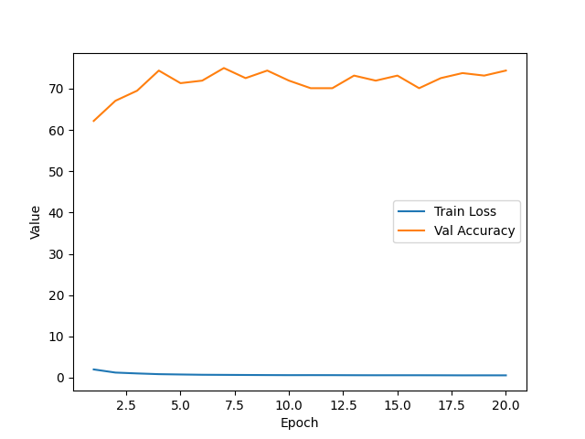
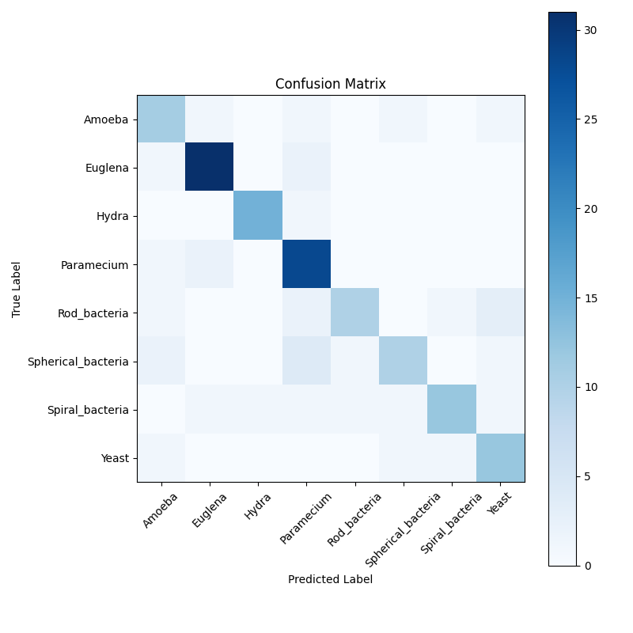
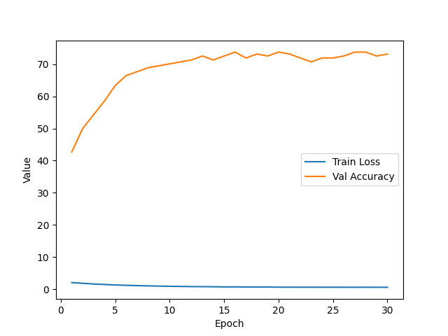
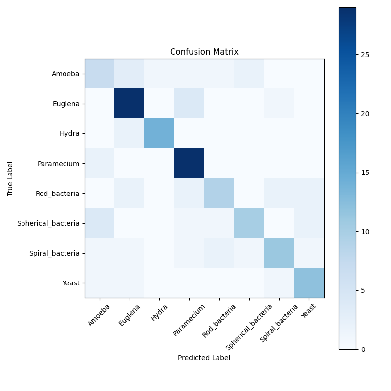
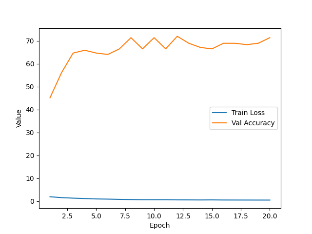
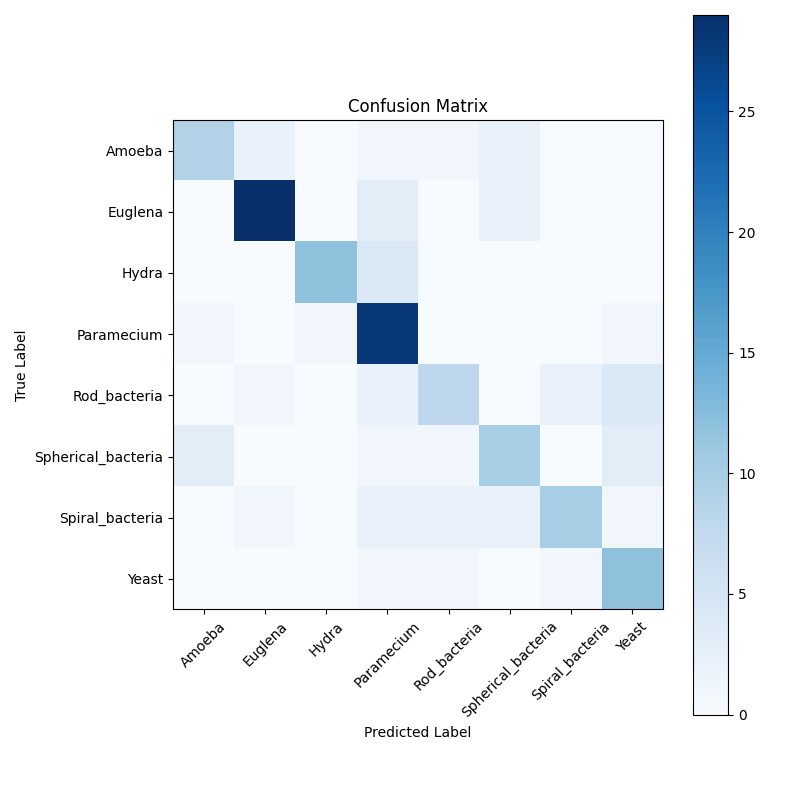

# Студенческий проект Квалификация бактерий и клеток с помощью CNN
## Цель
Разработка и обучение модели, способной квалифицировать по картинки различные классы бактерий и клеток.

## Стек:
- Pytorch
- Torchvision
- Matplotlib
- Sklearn

## Модели:
- ResNet18
- EfficientNetB0
- VGG16

 Я выбрал три модели, чтобы потом можно сравнить их точность на одном и том же датасете и выявить модель лучше подходящую для поставленной задачи.     
Если говорить конкретно про выбор моделей, то я взял ResNet18, потому что она использовалась на парах и дз,  а VGG16 и EfficientNetB0 выбрал из-за их различной архитектуры. Удобная и компактная у одной и сложная у другой. 

## Полученные результаты:
- ResNet18    

- EfficientNetB0     

- VGG16      

Обучение моделей я проводил на 32 batchax,  количество эпох было 30 (кроме VGG16 из-за слишкой медленной скорости), оптимизатором был выбран Adam и для функции потерь CrossEntropyLoss. Из аугментации проводил рандомный поворот, изменения яркости, отражение и масштабирование.      
У ResNet18 самый высокий результат был 79 процентов и в основном результат держался на 75+ процентах. У следующей модели результат чуть хуже, но довольно стабильный, точность в среднем была около 73, а лучший результат 74 процента. У VGG16 результат самый слабый, хоть и не сильно отстаёт от моделей до этого, но я не могу не отметить его очень медленную скорость обучения.    
На матрицах видно определённую закономерность в определении классов, а именно преобладание двух классов и классы в которых чаще всего появляются ошибки. Эта информация помогает осознать недостатки датасета и варианты кго улучшения. 

## Заключение
В заключении бы хотелось сказать, что в ходе данного проекта я значительно углубил свои знания в класификации и машиного обучения, полученные за полторы недели этого предмета. Прлученные результаты считаю удовлетворительными при небольшом датасете и индивидуального выполнения, ведь 79 процентов точности на примерно 10 классах уже не считается угадыванием, а именно определением по изученным изображениям.
